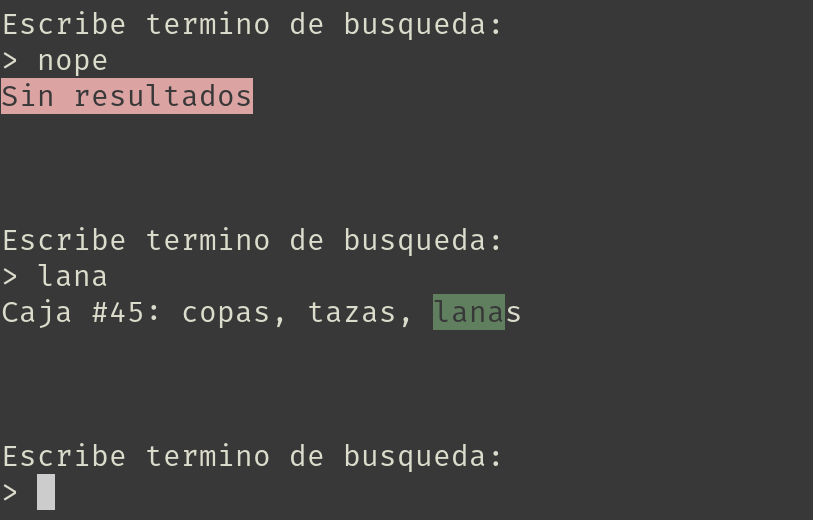

# Mudanza

## How to use it:

Use ruby 2.7.0

1. clone it
2. bundle install
3. Run it:

```sh
MUDANZA_FILE=/path/to/file.xlsx bundle exec ruby exe/mudanza
```

The excel file has 1 box per row and 1 thing per column


